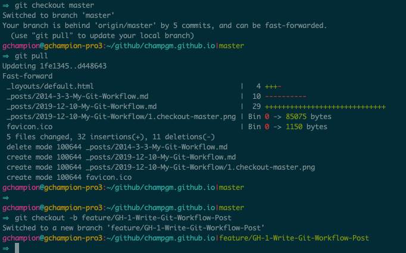

## Rambling
I worked at [Cerner](https://en.wikipedia.org/wiki/Cerner) for more than 5 years. For the last 3 and a half, I was on a team of more than 30 people, many of which were entirely new to [Git](https://en.wikipedia.org/wiki/Git) after a switch from [Subversion](https://en.wikipedia.org/wiki/Apache_Subversion). Personally, I was new to source control in general. We ran into problems constantly.
  * At first, we were using Git 1.X. Before 2.0, `git push origin` would push all branches in your local repository to the remote repository. Someone `git push -f origin`ed at least twice, overwriting our `master` and `wip` branches. Each time, leadership scrambled to find out who had pulled changes most recently so they could push those back to the remote repository.
  * Developers working on features dependent on features in progress often branched off of their teammates branches (with or without discussing it first) only to find, when they tried to update their branch, that their base branch's commit history had been modified, and/or the branch had been merged then deleted.
  * Merge conflicts were a daily part of life. A few of our files were 800-1200 lines long, so multiple developers working even just in the same module were likely to encounter conflicts every time they tried to get the most recent changes.
  * Some developers didn't attempt to retrieve changes often and, when they were ready to open a code review, would be faced with hours of work attempting to pick their changes apart from other features. Once done, they'd almost certainly be left with a healthy chunk of broken unit tests.
  * One contractor chose to pick all of his changes, then delete any broken unit tests. I don't think he was allowed back in the office once we figured out where all of our missing features went.

## Workflow
Most workflows I've followed attempted to follow (with varying degrees of success) the [git flow](https://nvie.com/posts/a-successful-git-branching-model/) model. Although that post is thorough, it gives a view that may be a little overwhelming, especially to a developer who just wants a workflow that'll minimize conflicts and time spent fighting git.

Essentially, there will likely be one or more branches in your repository that are considered "main" or "central". Names for these include `master`, `release`, `staging`, `develop`, `wip`, and the like. They typically represent the codebase at various stages of release. Which of these you branch off of depends on what you're trying to achieve, but hopefully you at least know which you should be using as your base branch.

### Happy Path
A quick summary of the happy path work flow should look something like this:

#### Pull Changes
Check out your base branch, pull any recent changes, and start a new branch for your work.

It's important to note here that I've prefixed my branch name. `feature` is a prefix from [git flow](https://nvie.com/posts/a-successful-git-branching-model/) that signifies from where I'm branching and what I intend to do in this branch. `GH-1` signifies that this branch is related to GitHub issue #1. If you were using something like JIRA, it would read `JIRAQUEUE-1` instead. This provides traceability back to the requirements of the feature this branch will implement. Ideally, all branches should be prefixed with at least an issue number, especially in a professional setting.

#### Add your feature
Write your tests, fix your bugs, etc. At this point, feel free to make as many commits as you'd like. Make them and push them often, especially before you leave work for the day. You never know what might happen to your local copy of the work you've done, or the computer on which it resides.

Once you think you're ready for a code review, take a look at your commit history with something like, "git log --pretty=oneline"

... post in progress